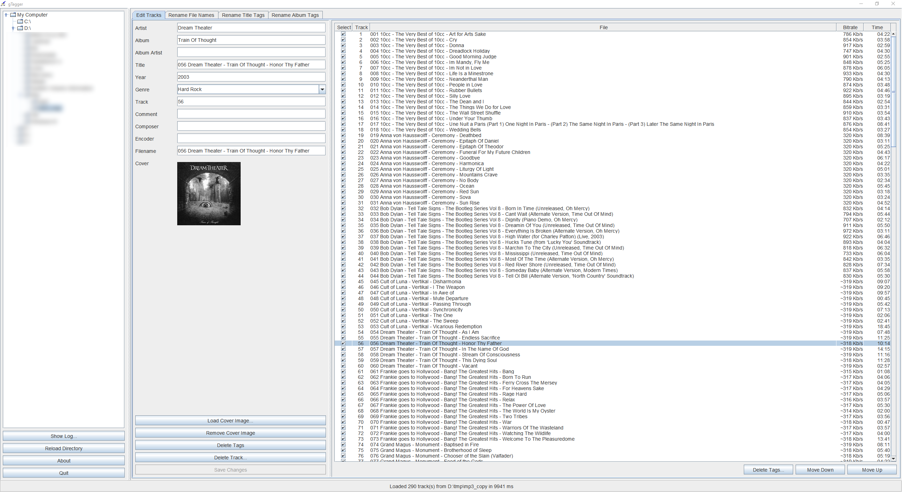

# gTagger
gTagger is an tag editor for audio files written in Kotlin.  
It can edit common audio tags and file names and also do batch operations on selected tracks. 

gTagger uses [JAudioTagger](http://www.jthink.net/jaudiotagger) library for reading and writing of audio files.
Source code from [bitbucket](https://bitbucket.org/ijabz/jaudiotagger/src/master).
JAudioTagger is released under the GNU Lesser General Public License. 

You will need [Java](http://java.com) installed to run this program. 

## License
gTagger is released under the [GNU General Public License v3.0](LICENSE). 

## Download
Download from [here](https://github.com/gnuwimp/gtagger/releases). 

## Run
Double click on the jar file to start the program in windows. 
Or run it from the command line with <code>"java -jar gtagger.jar"</code>. 

## Screenshots
 
