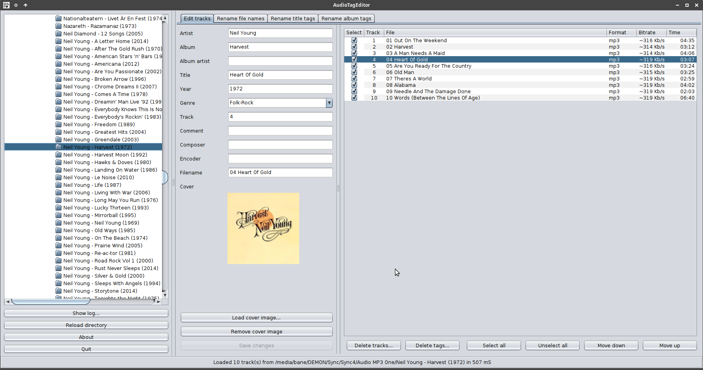
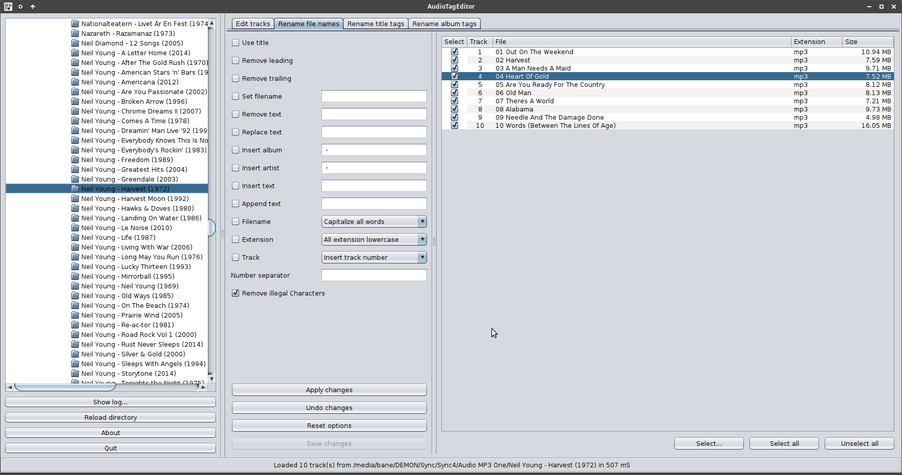
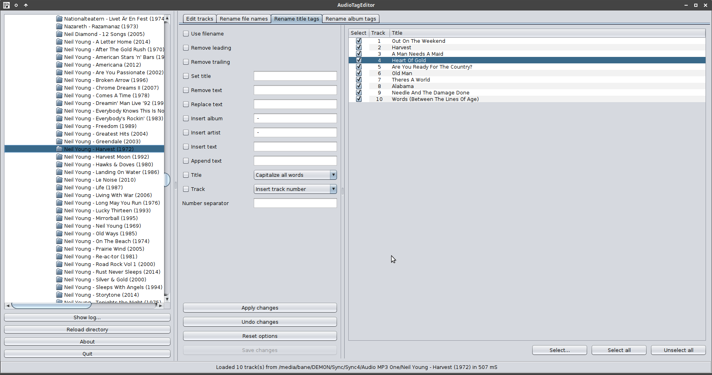
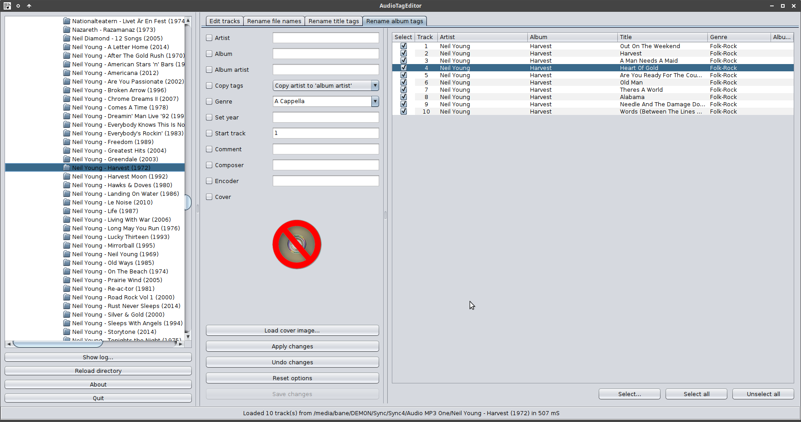

# AudioTagEditor

## About
AudioTagEditor is a metatag editor for audio files written in Kotlin.
It can edit common audio files and tags.
And also do batch operations on selected tracks.

AudioTagEditor is written in kotlin and released under the [GNU General Public License v3.0](LICENSE).
You will need [Java](http://java.com) installed to run this program.

## Download
Download AudioTagEditor from [here](https://github.com/gnuwimp/AudioTagEditor/releases).
[Java](https://java.com) is needed.

## Usage
Double-click on the jar file to start the program in windows.
Or run it from the command line with <code>java -jar AudioTagEditor.jar</code>.

## Screenshots

## Changes
<pre>
1.12:   tags that are not used in AudioTagEditor are now removed when saving tags to audio file

1.11:   updated Jaudiotagger library and added it to the source tree

1.1:    renamed from gTagger to AudioTagEditor
        ui changes
        bug fixes
</pre>
